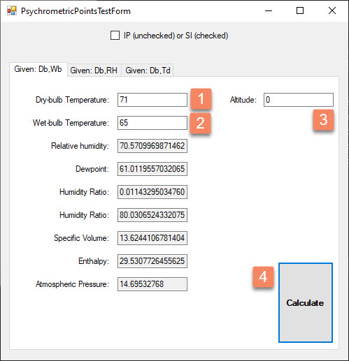

# PsychrometryLib
Psychrometric analysis library for .NET
 

### Works for Metric (SI) and Imperial (IP) units
For basics on Psychrometric calculations see https://www.sciencedirect.com/topics/engineering/psychrometrics

## Test form overview
If you build the solution it will produce an executable file named "PsychrometricTest.exe".

This executable launches a windows form that looks like this:

Usage:
1. Enter dry bulb temperature.
2. Enter wet-bulb temperature.
3. Optionally, enter the altitude.
4. Hit calculate

The library will calculate the rest of the properties.

## Available calculations
- Given __Dry-bulb__ temperature (Db) and __Wet-bulb__ temperature (Wb), calculate the other humid air properties.
- Given __Dry-bulb__ temperature (Db) and __Relative humidity__ (RH), calculate the other humid air properties.
- Given __Dry-bulb temperature__ (Db) and __Dew point__ (Td), calculate the other humid air properties.
- Given __two psychrometric points with assigned VolumetricFlowRate and MassicFlow__, calculate the humid air properties of the resulting mixture.

## Example uses
- Based on the interior dry-bulb temperature and relative humidity of a room, calculate the dew-point. This dewpoint is the temperature above which you must keep the interior surface of walls and windows in order to prevent condensation during the winter at those interior air conditions.

For code examples, see https://github.com/vinnividivicci/PsychrometryLib/blob/master/PsychrometricTest/PsychrometricPointsMixTest.cs and https://github.com/vinnividivicci/PsychrometryLib/blob/master/PsychrometricTest/PsychrometricPointsTestForm.cs
